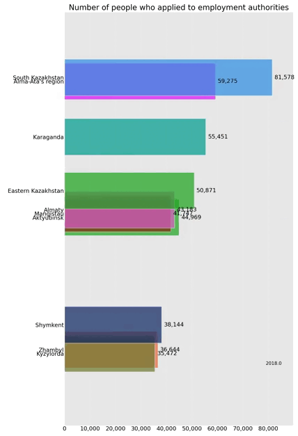

# Number of people who applied to employment authorities

## Installation

Clone the repository
```shell
$ git clone https://github.com/open-data-kazakhstan/people-applied-employment-authorities.git
```

Requires Python 3.12.0 

Package manager
```bash
pip install pip
```

Python software library for data processing and analysis
```bash
pip install pandas
```

Python library for visualizing data in 2D and 3D graphics
```bash
pip install matplotlib
```

Matplotlib add-on for data animation
```bash
pip install bar-chart-race
```

Create a virtual environment and activate it 
```bash
pip install venv
python -m venv /path/to/localrepo
```

Swicth to venv directory by using cd comand
```bash
cd /path/to/localrepo
Scripts/activate
```

Install dependecies in venv by using pip
```bash
pip install -r requirements.txt
```

Run the project:
```bash
python scripts/main.py
```
## Data 

Data on the number of people who applied to employment authorities were taken from https://gender.stat.gov.kz/ru/category/7

We downloaded the data from these sources and placed it in the acrhive folder as a raw.csv.

We processed the raw data to normalize it and obtained several aggregated data sets from it:

* `archive/raw.csv` - sourсe data
* `data/data.csv` - expanded main dataset
* `datapackage.json` - conatins all of the key information about our dataset

## Script

* `main.py` - main program script

## Visualization

The end result is visualized data showing the population that applied to the employment authorities over several years.



## License

This dataset is licensed under the Open Data Commons [Public Domain and Dedication License][pddl].

[pddl]: https://www.opendatacommons.org/licenses/pddl/1-0/
